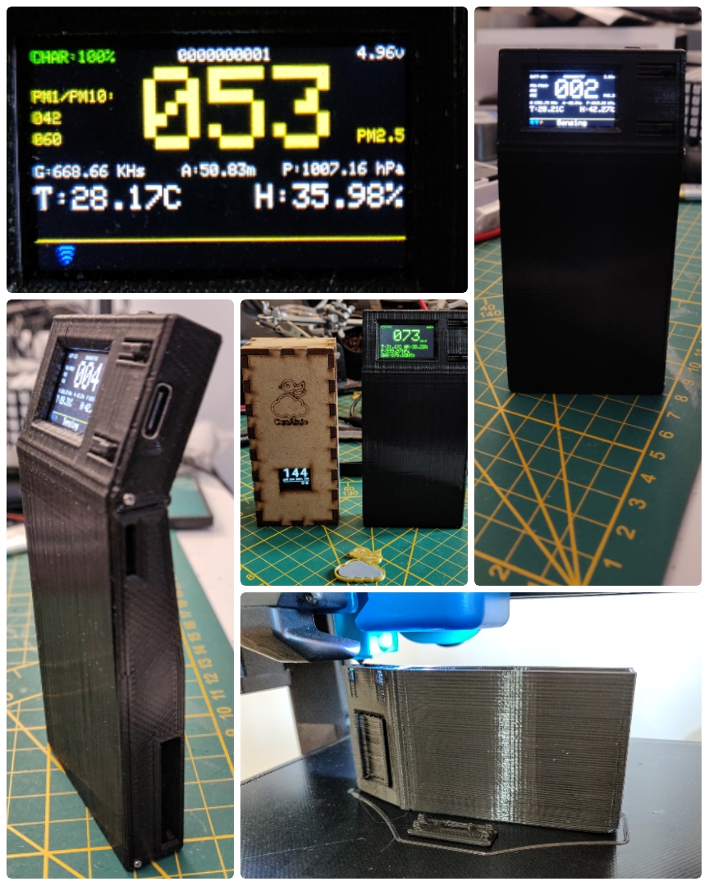
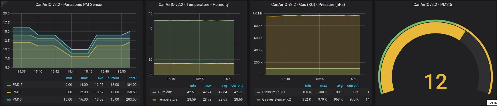
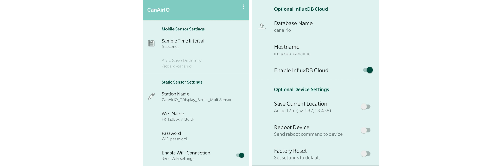
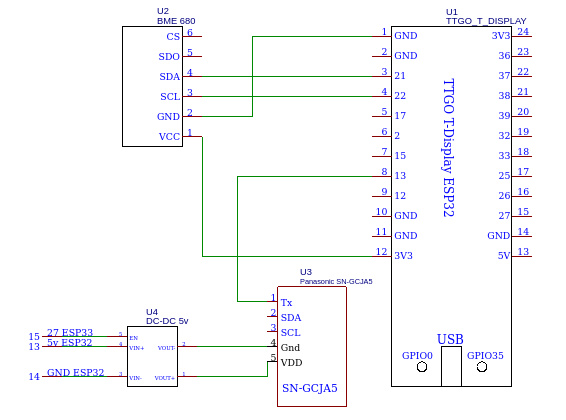
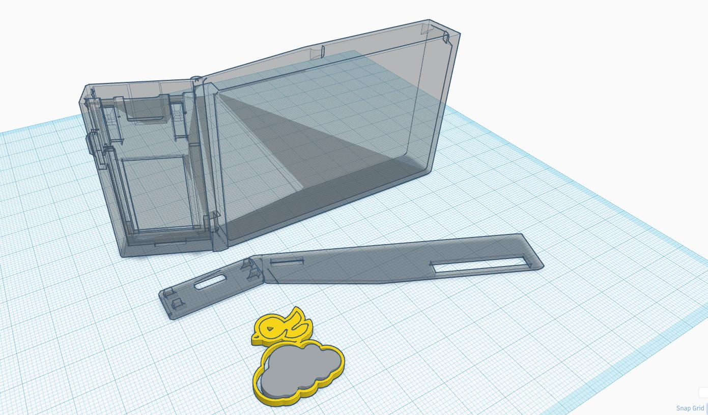

[](https://travis-ci.com/hpsaturn/CanAirIO) [](https://liberapay.com/CanAirIO)

# CanAirIO

Citizen science project with mobile and fixed sensors for measuring air quality (PM 2.5) using low-cost sensors and smartphones. Built with a `ESP32` module board and `Panasonic particle meter` dust sensor, interfaced with an [CanAirIO Android app](https://github.com/kike-canaries/android-hpma115s0).

<a href="https://play.google.com/store/apps/details?id=hpsaturn.pollutionreporter" target="_blank"></a>

This repo is a new version of CanAirIO that supports two Air Quality sensors: Panasonic PM Sensor and Bosch VOC sensor for IAQ.



**Warnning**: it is a complete rewriting of CanAirIO device firmware. Old repo: https://github.com/kike-canaries/esp32-hpma115s0

## Features


- [X] PM 1.0, 2.5 and PM 10 values.
- [X] Pressure, altitude, Humidity, Temperature.
- [X] Gas resistence (IAQ parameter)
- [X] Tag geo localization (mobile mode)
- [X] Save mobile trips on SD (mobile mode)
- [X] Share mobile tracks (mobile mode)
- [X] Set wifi parameters via Bluetooth (fixed mode)
- [X] Set geo localization via Bluetooth (fixed mode)
- [X] InfluxDB publication (fixed mode)
- [X] OTA updates via local WiFi
- [X] Enable/Disable sensor (for low power mode)

---

# Firmware

For compiling and upload the current firmware, please firts install [PlatformIO](https://platformio.org/install) or include the project in your `Arduino IDE`. Also you need the [Git](https://git-scm.com/downloads) software. Please check that the commands `pio` and `git` works fine in your OS.

## Compiling and Installing

First, please clone this repo:
```python
git clone https://github.com/hpsaturn/CanAirIO.git
```

Connect your device to USB cable , enter to `CanAirIO` directory and run:

```python
pio run --target upload
```

You should have something like this:
```python
Building .pio/build/ttgo-display/firmware.bin
RAM:   [==        ]  19.7% (used 64684 bytes from 327680 bytes)
Flash: [========= ]  86.4% (used 1698140 bytes from 1966080 bytes)
esptool.py v2.6
============== [SUCCESS] Took 33.86 seconds ==================

Environment       Status    Duration
----------------  --------  ------------
ttgo-display      SUCCESS   00:00:33.861
ttgo-display-ota  IGNORED
============= 1 succeeded in 00:00:33.861 =====================
```
## OTA update

**Optional** you could send OTA updates of this firmware with:

```python
pio run -e ttgo-display-ota --target upload
```

It will be try to send the firmware to CanAirIO.local host on your network, it this does not working, you can try to add IP parameter with `--upload-port=your_esp_ip`.

# Android CanAirIO application

For now you need any Android device with Bluetooth 4 or above. You can download the CanAirIO app from [GooglePlay](https://play.google.com/store/apps/details?id=hpsaturn.pollutionreporter), keep in mind that it is in continuos development then please any feedback, report errors, or any thing please let us knowed it via our [contact form](http://canair.io/#three) or on our [Telegram chat](https://t.me/canairio)

You have **two configuration options or modes** of your CanAirIO device from the app:

## Mobile Station Mode

For record tracks on your device (Sdcard) or publish it to the cloud (share), please follow the next steps:

### Connection to device

<a href="https://github.com/kike-canaries/esp32-hpma115s0/blob/master/images/device_connection.jpg" target="_blank"></a>

### Recording track and share

<a href="https://github.com/kike-canaries/esp32-hpma115s0/blob/master/images/app_track_record.jpg" target="_blank"></a>

**NOTE**: Also all recorded tracks will be saved in the `/sdcard/canairio/` directory on `json` format.

---

## Static Station Mode



Also, you can connect your CanAirIO device to the WiFi and leave this like a fixed station. In this mode you only need the Android app only for initial settings, after that the device could be publish data without the phone. For this you need configure it in `settings` section:

### Settings




- **Station Name**: for example: `PM25_Berlin_Pankow`
- **Wifi Name and Password**:
  - Your Wifi network credentials.
  - Save the credentials with the switch.
- **InfluxDB Cloud**: add the next values,
  - Database name: `canairio`  
  - Hostname: `influxdb.canair.io`
  - Save the settings with the switch.

The data will be configured and showed in [CanAirIO Grafana Server](https://bit.ly/3bLpz0H).

### Settings Tools

- Reboot device: Only for restart your CanAirIO device
- Factory Reset: For set all settings to default on your CanAirIO device


# Electronic components

## Schematic




## Components

| Description  | Alternative store link |
|----------------------------|-------------------------------|
| TTGO T-Display        |[AliExpress option](https://bit.ly/2z21vti) |
| Panasonic SN-GCJA5    |[Mouser international option](https://bit.ly/3bMmRYC) |
| Bosch BME680         |[AliExpress option](https://bit.ly/2LIB0eR) |
| DC-DC Booster **     |[AliExpress option](https://bit.ly/2LMm7Ip) |
| Lipo Battery 3.7 *** |[Amazon option](https://amzn.to/2FtzE5c)|
|      |      |

** NOTE: untested it, meanwhile I have a 2n2222 for enable/disable a normal boost without `enable` pin, but I think that it will be work.  
*** Any lipo battery with max size: 25x48x8 mm aprox. Please see the 3D box model. The battery in the link has 8.8x47x19.7 mm and is the ~500mAh.

---

# 3D Print box

You can download the 3D models in [Thingiverse](https://www.thingiverse.com/thing:4378483).




---

# Feedback

Please let us know about your questions on our [forum](https://foro.canair.io/), [contact](http://canair.io/#three) form or on our [Telegram](https://t.me/canairio) chat.

